 

  

 

## Tech Stack

### Languages

 

### Backend

 

### Frontend

 

### Databases

 

### DevOps & Cloud

### Operating System

### IDEs & Editors

 

## GitHub Stats

&nbsp;
&nbsp;

 

## Featured Projects

&nbsp;

&nbsp;

 

## Connect

 

